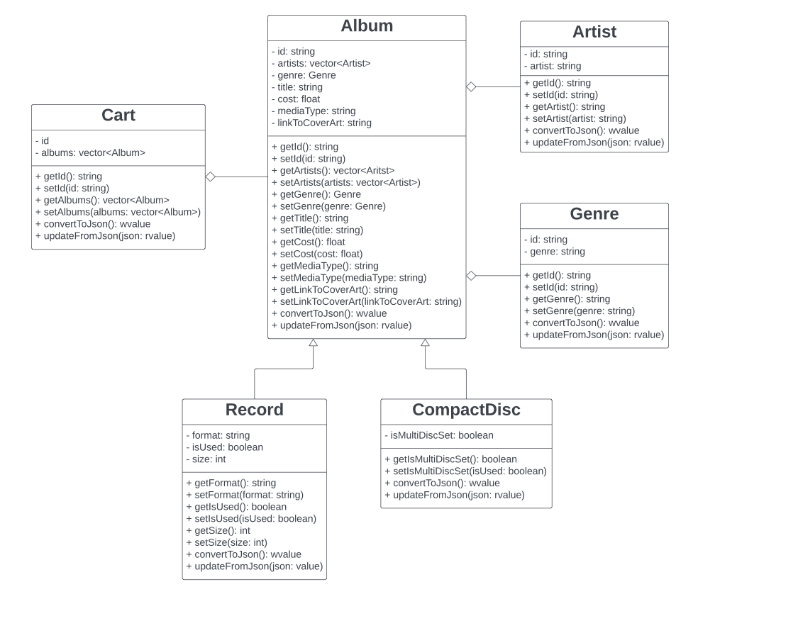

# Project Design Document

## Introduction

The Music Store API serves as a digital nexus for customers and music retailers, offering a comprehensive suite of tools for managing a music catalog. It allows for seamless interaction with data related to genres, artists, records, and compact discs, enabling users to access, modify, and curate music collections through a series of RESTful endpoints.


## Background/Context

The digital era has transformed music into a primarily online commodity, necessitating sophisticated systems for cataloging and sales. Customers seek intuitive ways to browse and purchase music, while retailers require robust solutions for inventory management. The Music Store API addresses these needs by providing a structured platform where information about music products is easily managed and retrieved. This not only enhances the user's browsing experience but also streamlines the retailer's operations, ensuring that the digital music marketplace remains vibrant and accessible.


## Stakeholders

- **Customers**: Individuals who use the API, directly or indirectly, to explore and purchase music. They are interested in easy access to a wide range of music data, including genres, artists, records, and compact discs. Their experience with the API impacts customer satisfaction and influences purchasing decisions.

- **Music Retailers**: Businesses or individuals who manage the sale and distribution of music. They rely on the API to effectively manage their inventory, update their product listings, and provide accurate information to their customers. The functionality and reliability of the API are crucial for their daily operations and sales performance.


## Functional Requirements

1. **Resource Creation**
   - The service shall allow music retailers to create new resource entries for genres, artists, records, and compact discs via POST requests.
   - The service shall validate all incoming data against predefined schemas before creating a new resource.
   - The service shall return a `201 Created` status code and the created resource in the response body upon successful creation.

2. **Resource Retrieval**
   - The service shall provide endpoints for customers and music retailers to retrieve lists of genres, artists, records, and compact discs via GET requests.
   - The service shall allow retrieval of detailed information for a single resource by its unique identifier.
   - The service shall return a `200 OK` status code and the requested resources in the response body upon successful retrieval.

3. **Resource Update**
   - The service shall permit music retailers to update existing resource entries for genres, artists, records, and compact discs via PUT requests.
   - The service shall validate all incoming data for updates against predefined schemas.
   - The service shall return a `200 OK` status code and the updated resource in the response body upon successful update.

4. **Resource Deletion**
   - The service shall enable music retailers to delete resource entries for genres, artists, records, and compact discs via DELETE requests.
   - The service shall return a `204 No Content` status code upon successful deletion.
   - The service shall return a `403 Forbidden` status code if an unauthorized user attempts to delete a resource.

5. **Data Validation**
   - The service shall enforce data validation rules to ensure that all resource data conforms to the expected formats, types, and constraints.
   - The service shall return a `400 Bad Request` status code along with error details if validation fails.

6. **Authentication and Authorization**
   - The service shall require authentication for users attempting to create, update, or delete resources.
   - The service shall authorize users based on their roles, permitting only authorized music retailers to modify or delete resource entries.

7. **Error Handling**
   - The service shall implement comprehensive error handling to provide meaningful error messages and appropriate HTTP status codes to the client for all failed operations.
   - The service shall return a `404 Not Found` status code when a requested resource cannot be located.
   - The service shall return a `500 Internal Server Error` status code in the event of unexpected server-side errors.


## Use Case Description

### Genres
- **Create (POST)**
  - As a music retailer, I want to add new genres that reflect the latest trends in music, so that customers can find the most current and popular categories.

- **Read (GET)**
  - As a customer, I want to explore the variety of music genres to discover new music that fits my preferences.
  - As a music retailer, I need to review the list of genres to organize my store's layout and recommend music to customers based on popular categories.

- **Update (PUT)**
  - As a music retailer, I want to update genre information to keep up with changes in music classification and ensure my inventory is correctly categorized.

- **Delete (DELETE)**
  - As a music retailer, I want to remove obsolete genres from my database to streamline my inventory management system.

### Artists
- **Create (POST)**
  - As a music retailer, I want to add profiles for new artists to my database to promote their music in my store and online platforms.

- **Read (GET)**
  - As a customer, I want to find artists that I like to see their available albums and records.
  - As a music retailer, I need to access the list of artists to update my inventory and create promotional material for upcoming releases.

- **Update (PUT)**
  - As a music retailer, I want to update artist profiles with new album releases or changes in their band lineup to provide customers with the latest information.

- **Delete (DELETE)**
  - As a music retailer, I need to remove artists who are no longer under contract or whose music is no longer carried in my store.

### Records
- **Create (POST)**
  - As a music retailer, I want to add new records to the catalog as they are released, to offer the latest music to my customers.

- **Read (GET)**
  - As a customer, I want to browse records to find new music releases or classic albums I wish to purchase.
  - As a music retailer, I need to view the complete list of records to manage my stock levels and ensure I have the latest releases available.

- **Update (PUT)**
  - As a music retailer, I want to update the records' information, like price or genre, to keep my inventory accurate and up-to-date for my customers.

- **Delete (DELETE)**
  - As a music retailer, I need to remove records that are no longer available or have been discontinued from my stock listings.

### CompactDiscs
- **Create (POST)**
  - As a music retailer, I want to list new compact discs as they become available, to ensure my product offerings are current.

- **Read (GET)**
  - As a customer, I want to look up compact discs for purchase, focusing on finding the best deals or rare finds.
  - As a music retailer, I need to review the compact discs in my inventory for pricing adjustments and stock replenishment.

- **Update (PUT)**
  - As a music retailer, I want to modify details about compact discs, such as price or stock quantity, to reflect changes in my inventory or promotions.

- **Delete (DELETE)**
  - As a music retailer, I need to delete listings of compact discs that are sold out or removed from my catalog to maintain an accurate online storefront.


## List Of Resources

- **Genre**: A category of music, such as Rock, Jazz, or Classical.
- **Artist**: An individual or group that performs music.
- **Record**: A physical medium for storing analog music.
- **Compact Disc**: A physical medium for storing digital music.


## List of End Points

In the context of this API, {id} would typically be replaced by a unique identifier for the resource, such as a string or a number that uniquely identifies a genre, artist, record, or compact disc.

### Genres
- **POST** `/api/genres`
  - **Description**: Create a new genre.
  - **Request BODY**: `{"id":"1", "genre":"Rock"}`
  - **Response**: `201 Created` with the created genre object in the body.
  - **Error**: `400 Bad Request` if input validation fails.

- **GET** `/api/genres`
  - **Description**: Retrieve a list of all genres.
  - **Response**: `200 OK` with an array of genre objects in the body.

- **GET** `/api/genres/{id}`
  - **Description**: Retrieve details of a specific genre.
  - **Response**: `200 OK` with the genre object in the body.
  - **Error**: `404 Not Found` if the genre does not exist.

- **PUT** `/api/genres/{id}`
  - **Description**: Update an existing genre.
  - **Request BODY**: `{"id":"1", "genre":"Rock"}`
  - **Response**: `200 OK` with the updated genre object in the body.
  - **Error**: `400 Bad Request` if input validation fails; `404 Not Found` if the genre does not exist.

- **DELETE** `/api/genres/{id}`
  - **Description**: Delete a specific genre.
  - **Response**: `204 No Content`.
  - **Error**: `404 Not Found` if the genre does not exist; `403 Forbidden` if the user is unauthorized.

### Artists
- **POST** `/api/artists`
  - **Description**: Add a new artist profile to the catalog.
  - **Request BODY**: `{"id":"1", "artist":"The Beatles"}`
  - **Response**: `201 Created` with the created artist object in the body.
  - **Error**: `400 Bad Request` if input validation fails.

- **GET** `/api/artists`
  - **Description**: Retrieve a list of all artist profiles.
  - **Response**: `200 OK` with an array of artist objects in the body.

- **GET** `/api/artists/{id}`
  - **Description**: Retrieve details of a specific artist.
  - **Response**: `200 OK` with the artist object in the body.
  - **Error**: `404 Not Found` if the artist does not exist.

- **PUT** `/api/artists/{id}`
  - **Description**: Update the profile of an existing artist.
  - **Request BODY**: `{"id":"1", "artist":"The Beatles"}`
  - **Response**: `200 OK` with the updated artist object in the body.
  - **Error**: `400 Bad Request` if input validation fails; `404 Not Found` if the artist does not exist.

- **DELETE** `/api/artists/{id}`
  - **Description**: Remove an artist profile from the catalog.
  - **Response**: `204 No Content`.
  - **Error**: `404 Not Found` if the artist does not exist; `403 Forbidden` if the user is unauthorized.

### Records
- **POST** `/api/records`
  - **Description**: Add a new record to the catalog.
  - **Request BODY**: 
    ```
    {
        "id": "1",
        "size": 12,
        "isUsed": true,
        "format": "EP",
        "title": "Let It Be",
        "linkToCoverArt": "https://upload.wikimedia.org/wikipedia/en/2/25/LetItBe.jpg",
        "cost": 15.99,
        "mediaType": "record",
        "genre": {
            "id": "1"
        },
        "artists": [
            {
                "id": "1"
            }
        ]
    }
    ```
  - **Response**: `201 Created` with the created record object in the body.
  - **Error**: `400 Bad Request` if input validation fails.

- **GET** `/api/records`
  - **Description**: Retrieve a list of all records.
  - **Response**: `200 OK` with an array of record objects in the body.

- **GET** `/api/records/{id}`
  - **Description**: Retrieve details of a specific record.
  - **Response**: `200 OK` with the record object in the body.
  - **Error**: `404 Not Found` if the record does not exist.

- **PUT** `/api/records/{id}`
  - **Description**: Update the details of an existing record.
  - **Request BODY**: 
    ```
    {
        "id": "1",
        "size": 12,
        "isUsed": true,
        "format": "EP",
        "title": "Let It Be",
        "linkToCoverArt": "https://upload.wikimedia.org/wikipedia/en/2/25/LetItBe.jpg",
        "cost": 15.99,
        "mediaType": "record",
        "genre": {
            "id": "1"
        },
        "artists": [
            {
                "id": "1"
            }
        ]
    }
    ```
  - **Response**: `200 OK` with the updated record object in the body.
  - **Error**: `400 Bad Request` if input validation fails; `404 Not Found` if the record does not exist.

- **DELETE** `/api/records/{id}`
  - **Description**: Remove a record from the catalog.
  - **Response**: `204 No Content`.
  - **Error**: `404 Not Found` if the record does not exist; `403 Forbidden` if the user is unauthorized.

### CompactDiscs
- **POST** `/api/compactdiscs`
  - **Description**: Add a new compact disc to the inventory.
  - **Request BODY**:
    ```
    {
        "id": "1",
        "isMultiDiscSet": false,
        "title": "Abbey Road",
        "linkToCoverArt": "https://upload.wikimedia.org/wikipedia/en/4/42/Beatles_-_Abbey_Road.jpg",
        "cost": 15.99,
        "mediaType": "cd",
        "genre": {
            "id": "1"
        },
        "artists": [
            {
                "id": "1"
            }
        ]
    }
    ```
  - **Response**: `201 Created` with the created compact disc object in the body.
  - **Error**: `400 Bad Request` if input validation fails.

- **GET** `/api/compactdiscs`
  - **Description**: Retrieve a list of all compact discs in the inventory.
  - **Response**: `200 OK` with an array of compact disc objects in the body.

- **GET** `/api/compactdiscs/{id}`
  - **Description**: Retrieve details of a specific compact disc.
  - **Response**: `200 OK` with the compact disc object in the body.
  - **Error**: `404 Not Found` if the compact disc does not exist.

- **PUT** `/api/compactdiscs/{id}`
  - **Description**: Update the details of an existing compact disc.
  - **Request BODY**:
    ```
    {
        "id": "1",
        "isMultiDiscSet": false,
        "title": "Abbey Road",
        "linkToCoverArt": "https://upload.wikimedia.org/wikipedia/en/4/42/Beatles_-_Abbey_Road.jpg",
        "cost": 15.99,
        "mediaType": "cd",
        "genre": {
            "id": "1"
        },
        "artists": [
            {
                "id": "1"
            }
        ]
    }
    ```
  - **Response**: `200 OK` with the


### Error Handling Strategies
- **Validation Errors**: Respond with `400 Bad Request` and include the error details.
- **Authentication/Authorization Errors**: Utilize `401 Unauthorized` for authentication issues and `403 Forbidden` for authorization issues.
- **Not Found Errors**: Use `404 Not Found` when a resource cannot be located.
- **Server Errors**: Respond with `500 Internal Server Error` for unexpected server-side issues.

This API will also use standard HTTP status codes to communicate the outcome of API requests, ensuring that clients can handle responses appropriately.


## UML Diagrams



